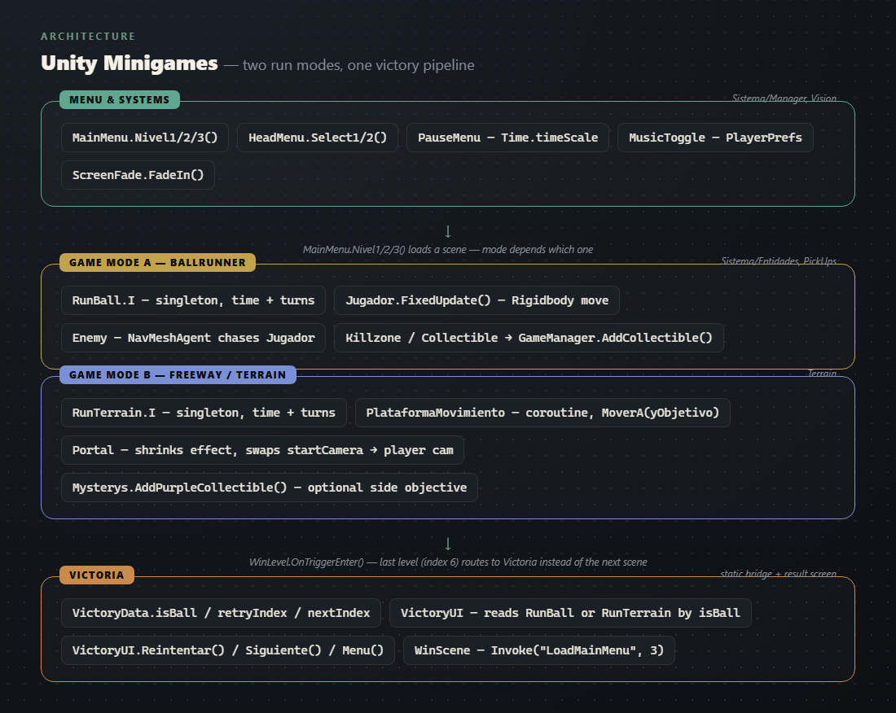

# Architecture

Two small 3D minigames built during a Unity workshop: **BallRunner** (roll a ball through a
sequence of levels, dodge an enemy, collect coins to open a gate) and a **Freeway/Terrain runner**
(moving platforms, a portal that swaps cameras, purple collectibles as an optional side quest).
Both share one main menu, one pause system, and one victory screen.

**Why C# and Unity**: the workshop's brief, not a choice — Unity only scripts in C#. What's here
shows how I used it: singletons (`RunBall.I` / `RunTerrain.I`) to carry elapsed time and attempt
count across scene loads, a `NavMeshAgent` for the enemy's chase behavior, a coroutine for the
moving platform's back-and-forth motion, and `PlayerPrefs` so the music-mute setting survives a
restart.

## Structure

Scripts are grouped the way the original Unity project organized them:

- `Sistema/Manager` — menus (`MainMenu`, `HeadMenu`), `GameManager` (tracks coins, opens the gate
  once they're all collected), `Killzone` (respawns the level on a fall), `MusicToggle` (mute
  state persisted via `PlayerPrefs`).
- `Sistema/Entidades` — `Jugador` (Rigidbody-based movement) and `Enemy` (`NavMeshAgent` chases the
  player, respawns the level on contact).
- `Sistema/PickUps` — `Collectible`, reports back to `GameManager`.
- `Sistema/Victoria` — `VictoryUI` (reads whichever run mode just finished), `WinLevel` (advances
  to the next level or routes to the victory scene), `WinScene` (auto-returns to the menu after a
  few seconds).
- `Terrain` — the second game mode: `PlataformaMovimiento` (moving platform, driven by a
  coroutine), `Portal` (shrinks a visual effect, then swaps from the start camera to the player
  camera), `Mysterys` / `PurpleCollectible` (an optional easter-egg objective).
- `Vision` — `CameraFollow`, `PauseMenu` (`Time.timeScale` pause), `ScreenFade` (fade-in on scene
  load), `Tiempo` (on-screen timer), `CompleteNote` (a shake-then-fade toast for in-game messages).

`VictoryData` is a small static class that carries which mode just finished, and which scene to
retry or load next, from the gameplay scene into the shared victory screen — the simplest way to
pass state between scenes without a full save system.

## Language / framework breakdown

| Part | Technology |
|---|---|
| Scripting | C# (Unity's only supported scripting language) |
| Engine features used | Rigidbody physics, NavMesh AI, TextMeshPro UI, coroutines |
| Persistence | `PlayerPrefs` (music-mute setting only) |

## Data and external services

None — everything is local to the Unity project, no network calls or database.

## What's not here

This repo holds the C# scripts only — no `.unity` scenes, no prefabs, no meshes, no audio, no
Unity project settings. `document/UNITY WORKSHOP.pdf` is the original workshop brief; it is not
game content. Without the scenes and assets behind them, these scripts don't compile into a
project or run on their own — this is a documentation pass over the part of the project that's
actually mine to show on its own: the code.

## Running it

The scripts here don't run on their own. The full playable game (Windows and Linux) is attached
to the [latest release](../../releases/latest).
