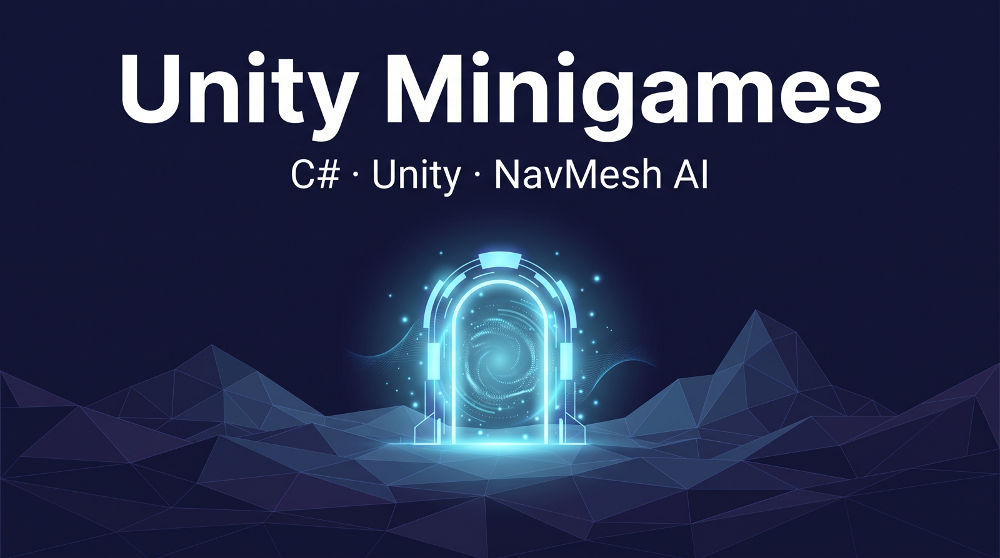
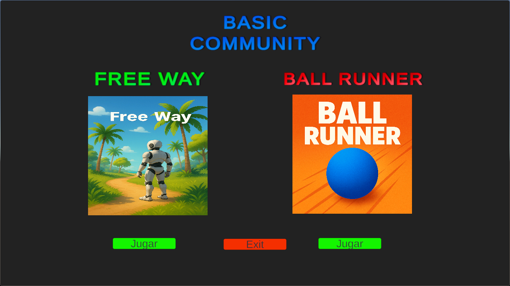
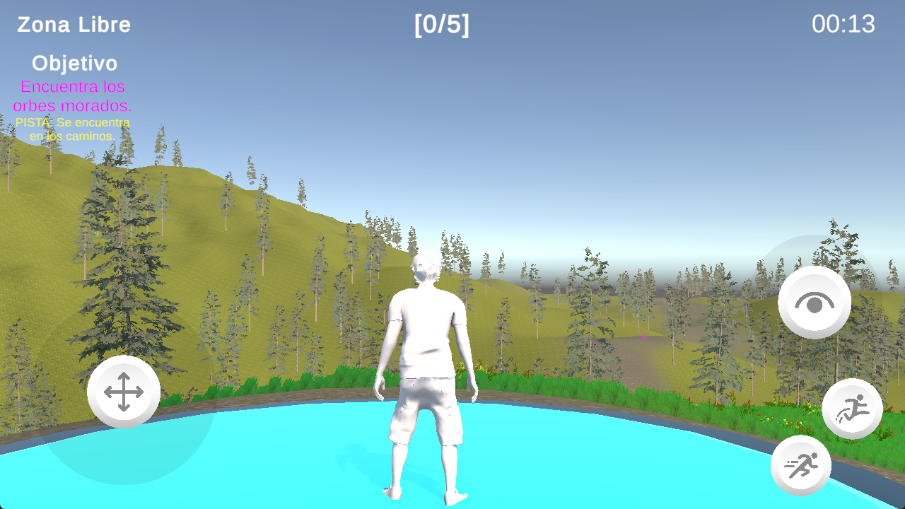
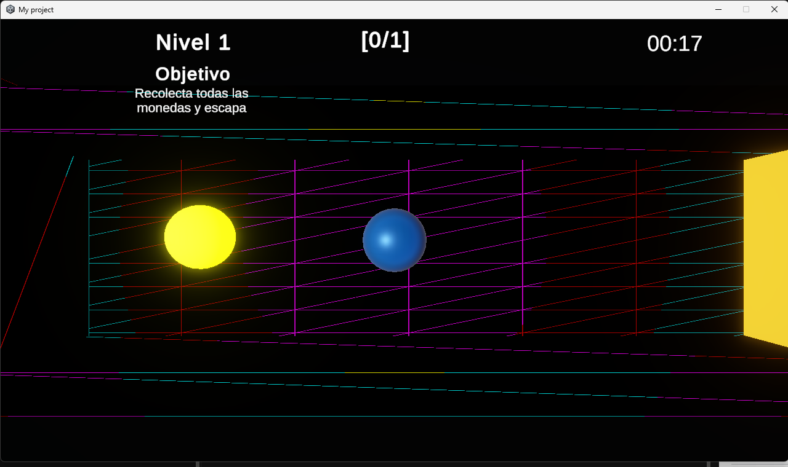

# Unity Minigames

Two small 3D minigames built for a Unity workshop, sharing one menu: **Free Way**, a calm
exploration zone where you hunt down five hidden orbs, and **Ball Runner**, a physics ball-roller
where you dodge an AI enemy and collect coins to open the exit gate.

## The two games

**Free Way** — the relaxed one. You explore an open forest terrain with no enemy and no way to
lose, hunting five purple orbs hidden along the paths while a timer counts up. A portal at the
start hands control from an intro camera over to you, and there are a few moving platforms along
the way. Find all five orbs and the run is done. It's a chill-out zone with a light "spot the
hidden thing" puzzle on top.

**Ball Runner** — the arcade one. You roll a ball through three short levels, dodging an AI enemy
that chases you across a NavMesh. Touch it and the level restarts with your attempt count going
up. Collect every coin in a level to open the yellow gate and move to the next one. Clear all
three to win.

Both games end on the same victory screen, which reports your time and how many attempts it took.

## Play it

Playable builds are attached to the [latest release](../../releases/latest):

- **Windows** — download `Windows.zip`, extract, run `My project.exe`
- **Linux** — download `Ubuntu.zip`, extract, run `Ubuntu.x86_64`

Those builds contain the full Unity project — 7 scenes, both game modes. This
repository holds only the C# scripts pulled out of that project (no scenes,
prefabs or meshes), so there is nothing to open in the Unity editor here. See
[ARCHITECTURE.md](./ARCHITECTURE.md) for what the code does and how the two game
modes fit together.

## Screenshots

From the Windows build.

## Architecture

See [ARCHITECTURE.md](./ARCHITECTURE.md) for the full breakdown.

## License

PolyForm Noncommercial 1.0.0 ([LICENSE](./LICENSE)). Personal, non-commercial use only —
the code and the playable build alike.
